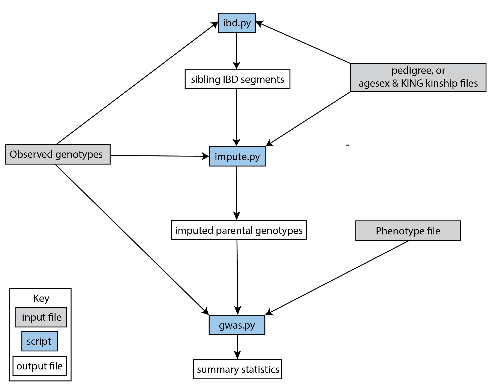

# snipar

<p align="center">
  
</p>


[](https://snipar.readthedocs.io/en/latest/index.html)
[](https://snipar.readthedocs.io/en/latest/guide.html)
[](https://snipar.readthedocs.io/en/latest/tutorial.html)


*snipar* (single nucleotide imputation of parents) provides a command line toolbox for family-based analyses in genetics: 

- **family-GWAS**: Perform family-GWAS (FGWAS) with a variety of estimators. *snipar* can perform family-GWAS using genetic differences between siblings, parent-offspring trios, and increase power through using imputed parental genotypes, which enables inclusion and optimal use of samples with only one parent genotyped. See [Tutorial: family-GWAS without imputed parental genotypes](https://snipar.readthedocs.io/en/latest/tutorial.html#family-based-gwas-without-imputed-parental-genotypes) and [Tutorial: family-GWAS with imputed parental genotypes](https://snipar.readthedocs.io/en/latest/tutorial.html#family-based-gwas-with-imputed-parental-genotypes). The regressions are performed in an efficient linear mixed model that accounts for correlations between siblings and more distant relatives.
- **family-PGS analyses**: Compute and analyze polygenic scores (PGS) for a set of individuals along with their siblings and parents, using both observed and imputed parental genotypes. *snipar* can estimate the direct effect (within-family) effect of a polygenic score: see [Simulation Exercise: Polygenic score analyses](https://snipar.readthedocs.io/en/latest/simulation.html#polygenic-score-analyses). It can adjust for the impact of assortative mating on estimates of indirect genetic effects (effects of alleles in parents on offspring mediated through the environment) from family-based PGS analysis: see [Simulation Exercise: Polygenic score analyses](https://snipar.readthedocs.io/en/latest/simulation.html#polygenic-score-analyses).
- **Imputation of missing parental genotypes**: For samples with at least one genotyped sibling and/or parent, but without both parents' genotypes available, *snipar* can impute missing parental genotypes according to Mendelian laws (Mendelian Imputation) and use these to increase power for family-GWAS and PGS analyses. See [Tutorial: imputing-missing-parental-genotypes](https://snipar.readthedocs.io/en/latest/tutorial.html#imputing-missing-parental-genotypes)
- **Identity-by-descent (IBD) segments shared by siblings**: *snipar* implements a hidden markov model (HMM) to accurately infer identity-by-descent segments shared between siblings. The output of this is needed for imputation of missing parental genotypes from siblings. See [Tutorial: inferring IBD between siblings](https://snipar.readthedocs.io/en/latest/tutorial.html#inferring-ibd-between-siblings)
- **Multi-generational forward simulation with indirect genetic effects and assortative mating**: *snipar* includes a simulation module that performs forward simulation of multiple generations undergoing random and/or assortative mating of different strengths. The phenotype on which assortment occurs can include indirect genetic effects from parents. Users can input phased haplotypes for the starting generation or artificial haplotypes can be simulated. Output includes a multigenerational pedigree with phenotype values, direct and indirect genetic component values, and plink formatted genotypes for the final two generations along with imputed parental genotypes. See [Simulation Exercise](https://snipar.readthedocs.io/en/latest/simulation.html)
- **Estimate correlations between effects**: Family-GWAS summary statistics include genome-wide estimates of direct genetic effects (DGEs) — the within-family estimate of the effect of the allele — population effects — as estimated by standard GWAS — and non-transmitted coefficients (NTCs), the coefficients on parents' genotypes. The *correlate.py* scipt enables efficient estimation of genome-wide correlations between these different classes of effects accounting for sampling errors. See [Tutorial: correlations between effects](https://snipar.readthedocs.io/en/latest/tutorial.html#correlations-between-effects)

This illustrats an end-to-end workflow in *snipar* although not all steps are necessary for all analyses. For example, family-GWAS and PGS analyses can be performed without imputed parental genotypes, requiring only input genotypes in .bed or .bgen format along with pedigree information:

<p align="center">
  
</p>

# Publications

The methodologies implemented in *snipar* are described in the following publications: 

[](https://www.nature.com/articles/s41588-022-01085-0)  
**Mendelian imputation of parental genotypes improves estimates of direct genetic effects.**
*[Alexander Strudwick Young](https://alextisyoung.github.io/), SM Nehzati, ..., Augustine Kong.*
Describes the method for imputation of missing parental genotypes and family-based GWAS with imputed parental genotypes.
[🔗 Full Text](https://www.nature.com/articles/s41588-022-01085-0)

[](https://www.biorxiv.org/content/10.1101/2023.07.10.548458v1)  
**Estimation of indirect genetic effects and heritability under assortative mating.**  
**[Alexander Strudwick Young](https://alextisyoung.github.io/).*  
Describes family-PGS analysis with adjustment for the impact of assortative mating on estimates of indirect genetic effects. 
[🔗 Full Text](https://www.biorxiv.org/content/10.1101/2023.07.10.548458v1)

[](https://doi.org/10.1101/2024.10.01.24314703)  
**Family-GWAS reveals effects of environment and mating on genetic associations.**  
*T Tan, H Jayashankar, J Guan, SM Nehzati, M Mir, M Bennett, E Agerbo, ..., *[Alexander Strudwick Young](https://alextisyoung.github.io/).*
Shows *snipar* applied to generate family-GWAS summary statistics from 17 different cohorts that are meta-analyzed. Describes the methodology for estimating genome-wide correlations between the different classes of effects estimated by family-GWAS. 
[🔗 Full Text](https://doi.org/10.1101/2024.10.01.24314703)

[](https://www.nature.com/articles/s41588-025-02118-0)  
**Family-based genome-wide association study designs for increased power and robustness.**
Describes additional family-GWAS designs: the *unified estimator*, which increases power for estimating direct genetic effects in homogeneous samples (typical for GWAS) by including all samples through linear imputation; and the *robust estimator*, which maximizes power in strongly structured or admixed samples without introducing bias. The linear mixed model used in *snipar* family-GWAS and PGS analyses is described here.
*Junming Guan, T Tan, SM Nehzati, M Bennett, P Turley, DJ Benjamin, [Alexander Strudwick Young](https://alextisyoung.github.io/).*
[🔗 Full Text](https://www.nature.com/articles/s41588-025-02118-0)

# Main features:

Infer identity-by-descent segments shared between siblings (ibd.py). 

Impute missing parental genotypes given the observed genotypes in a nuclear family (impute.py).

Perform family based GWAS using various estimators (gwas.py). 

Compute polygenic scores for probands, siblings, and parents from SNP weights using observed/imputed parental genotypes, and perform family
 based analysis of polygenic scores (pgs.py script). 
 
 Compute genome-wide correlations between different effects estimated by gwas.py (correlate.py). 

 Simulate genotype and phenotypes under different scenarios: direct and indirect genetic effects, vertical transmission, assortative mating (simulate.py). 

# Documentation

Documentation: https://snipar.rtfd.io/

It is recommended to read the guide: https://snipar.rtfd.io/en/latest/guide.html

And to work through the tutorial: https://snipar.readthedocs.io/en/latest/tutorial.html

# Installing Using pip

*snipar* currently supports Python 3.7-3.9 on Linux, Windows, and Mac OSX (although not currently available for Mac through pip). We recommend using a python distribution such as Anaconda 3 (https://store.continuum.io/cshop/anaconda/). 

The easiest way to install is using pip:

    pip install snipar

Sometimes this may not work because the pip in the system is outdated. You can upgrade your pip using:

    pip install --upgrade pip

# Virtual Environment

You may encounter problems with the installation due to Python version incompatability or package conflicts with your existing Python environment. To overcome this, you can try installing in a virtual environment. In a bash shell, this could be done either via the *venv* Python package or via conda.

To use venv, use the following commands in your directory of choice:
    
    python -m venv path-to-where-you-want-the-virtual-environment-to-be

You can activate and use the environment using

    source path-to-where-you-want-the-virtual-environment-to-be/bin/activate

Alternatively, we highly recommend using conda:
	
  conda create -n myenv python=3.9
	conda activate myenv

# Installing From Source
To install from source, clone the git repository, and in the directory
containing the *snipar* source code, at the shell type:

  pip install .

Note: installing *snipar* requires the package *bed_reader*, which in turn requires installing Rust. If error occurs at "Collecting bed-reader ...", please try downloading Rust following the instruction here: https://rust-lang.github.io/rustup/installation/other.html.

# Python version incompatibility 

*snipar* does not currently support Python 3.10 or higher due to version incompatibilities of dependencies. 
To overcome this, see **Virtual Environment** above.

# Apple ARM processor machines

There can be difficulties install *snipar* on Apple ARM processor machines due
to lack of available versions of scientific computing software made for these
processors' architectures. A workaround for this is to use *Snipar* in a docker
container.

The following steps will guide you on how to create a suitable container for
your M1/M2 MacBook and seamlessly integrate it into a VSCode environment. These
steps assume you have little knowledge about Docker, so we will start from
scratch.

## 1. Installing Docker Engine

Ensure that Docker Engine is installed on your machine. If it's already
installed, you can skip this step. Otherwise, you can install it by following
the instructions provided at the following link:

[Install Docker Engine on a MacBook](https://docs.docker.com/desktop/install/mac-install/)

## 2. Creating the Docker Container

To install the Snipar package, you need to create a Docker container that
emulates a virtual Ubuntu machine where Snipar can be installed.

To create the appropriate Docker container, follow these steps:

- Start the Docker engine. Just open the Docker application from your
  Applications folder.

- While the engine is running, open your terminal and execute the following
  command to create a container named "snipar_container" (you can choose a
  different name if you prefer):

  ```bash
  docker run --name snipar_container -it amd64/python:3.9.9-slim-buster /bin/bash
  ```

After running this command, you should see the "snipar_container" listed in the
Docker GUI under the "Containers" tab.

- You can close the terminal at this point.

## 3. Running the Container

To use the environment of the created container within VSCode or other IDEs,
ensure that the container is running. You can do this easily through the Docker
GUI:

- Open the Docker GUI.
- In the "Containers" section of the dashboard, locate "snipar_container" (or
  the name you chose for your container).
- Click the play button to start the container.

Once the container is running, you can access its terminal and files through the
Docker GUI. Keep in mind that the files within the container are isolated from
your macOS files. You won't be able to access them using Finder, but you can
manage them through the Docker GUI, including uploading and downloading.

## 4. Attaching the Container to VSCode

If you prefer a smoother development experience with VSCode, follow these steps
to attach the container to VSCode:

- Install the "Dev Containers" extension by visiting the following link in the
  VS Marketplace:

  [Dev Containers Extension](https://marketplace.visualstudio.com/items?itemName=ms-vscode-remote.remote-containers)

- Once installed, a new icon will appear on the left sidebar of VSCode labeled "
  Remote Explorer."

- Click on "Remote Explorer" and, under the "Dev Containers" section, locate "
  snipar_container."

- Next to the container name, you'll find a button that says "Attach in a new
  window." Click on this button, and VSCode will open a new window attached to
  the container.

In the newly attached VSCode window, the terminal will be connected to the
container, similar to the "Exec" tab in the Docker GUI. You can also open
folders from the container environment (not your Mac itself) using the "Open
Folder" button in VSCode. This makes it more convenient to manage files while
writing code, and you can run your modules using the terminal directly within
VSCode.

## 5. Installing *snipar* Package in the Container

Up to this point, you've set up the environment for snipar but haven't installed
it in the container. To install snipar, follow these steps:

- Open the terminal in the VSCode window attached to "snipar_container" (or use
  the "Exec" tab in the Docker GUI).
- After cloning the git repository and cding into the directory, run the following command:
  ```bash
  pip install .
  ```
   
# Running tests
To check that the code is working properly and that the C modules have been compiled, you can run the tests using this command:

    python -m unittest snipar.tests
