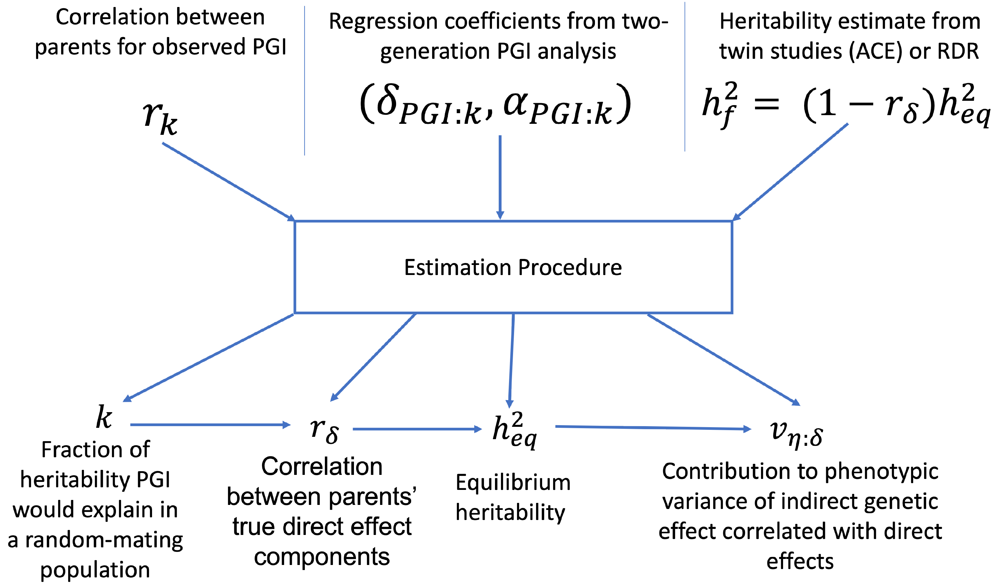

.. _simulation:
===================
Simulation Exercise
===================

Exercise on simulating data using the simulate.py script and performing family-based polygenic score analysis. 

Simulating data
--------------------

If *snipar* has been installed succesfully, the :ref:`command line scripts <scripts>` should be accessible as
executables in your terminal. *snipar* includes a script for simulating genotype-phenotype data according to 
different scenarios: direct and indirect genetic effects, with and without assortative mating. 
To simulate data, please first create a directory to store the data:

    ``mkdir sim``

Now, we are going to simulate data for 3000 families, each with two full-siblings, genotyped at 1000 independent SNPs. 
We simulate a phenotype affected by direct genetic effects and assortative mating. 
We are going to simulate 20 generations of assortative mating with parental phenotype correlation 0.5, reaching an approximate equilibrium. 
The command for this is:

    ``simulate.py 1000 0.5 sim/ --nfam 3000 --impute --n_am 20 --r_par 0.5 --save_par_gts``

where the first argument gives the number of causal SNPs, the second argument gives the 
random mating heritability, the third gives the output directory, --nfam gives the number of families, --impute 
tells the script to impute missing parental genotypes, --n_am gives the number of generations of assortative mating,
the parental phenotype correlation is given by --r_par, and --save_par_gts tells the script to output the 
genotypes of the parents of the final generation in addition to the genotypes of the final generation.

Please change your working directory to sim/:

    ``cd sim``

The genotype data (chr_1.bed) has been simulated so that there are 3000 independent families, each with two siblings genotyped.

The pedigree file (pedigree.txt) contains the pedigree for all simulated generations. The pedigree has columns:
FID, IID, Father_ID, MOTHER_ID, SEX, PHENO, FATHER_PHENO, MOTHER_PHENO, DIRECT, FATHER_DIRECT, MOTHER_DIRECT. 
The FID and IID columns are the family and individual IDs, respectively. The Father_ID and MOTHER_ID columns are the IDs of the parents of the individual.
The FATHER_PHENO and MOTHER_PHENO columns are the phenotype values of the parents, and the DIRECT, FATHER_DIRECT, and MOTHER_DIRECT columns are the direct genetic effect components of the individual, father, and mother, respectively.
The FIDs follow the format ``generation_family``, and the IIDs follow the format ``generation_family_individual``.
So if you look at the end of pedigree.txt (e.g. using ``tail pedigree.txt``), you should see
the FID of the last line as ``20_2999``, and the IID of the last line as ``20_2999_1``.

To enable analysis of the final generation phenotypes alone, we have placed the phenotype values for the final generation in a separate file (phenotype.txt). 

We have also included a file (last_gen_rel.seg) that records the sibling and cousin relationships in the final generation to give an example of how a sparse genetic relatedness matrix, a :ref:`GRM <GRM>`,
can be provided to the :ref:`gwas.py <gwas.py>` and :ref:`pgs.py <pgs.py>` scripts. This tab or white space delimited text file has a row for each pairwise relationship with (minimally) columns
giving ID1, ID2, and a column named 'PropIBD' or 'relatedness' giving the relatedness coefficient. 
This is designed to work with the output of the `KING <https://www.kingrelatedness.com/manual.shtml>`_ IBD segment inference with the --ibdseg argument.
But other ways of computing relatedness coefficient can be used, such as from a pedigree. 

A GRM is not required to run family-GWAS or PGS analyses. By default, a linear mixed model that accounts for correlations 
between siblings will be used. By providing a GRM, correlations between other relatives can be modelled, 
leading to increased power and more accurate standard errors when other relative types are present in the analysis sample. 

Family-based GWAS without imputed parental genotypes
----------------------------------------------------

To perform a family-based GWAS, we use the :ref:`gwas.py <gwas.py>` script. 
To perform a family-based GWAS without imputed parental genotypes, use the following command:

    ``gwas.py phenotype.txt --pedigree pedigree.txt --bed chr_@ --grm last_gen_rel.seg --out chr_@_sibdiff --cpus 1``

The first argument is the phenotype file. As we are not inputting an imputed parental genotype file,
we must specify a pedigree file using the ``--pedigree`` argument. 
The genotype data in .bed format is specified by ``--bed chr_@`` argument.
The ``@`` symbol is a placeholder for the chromosome number, so the script will read the genotype data from ``chr_1.bed``. 
The output file is specified by ``--out chr_@_sibdiff``. The script will output summary statistics to a gzipped text file: ``chr_1_sibdiff.sumstats.gz``.
The ``--cpus`` argument can be used to specify the number of processes to use to parallelize the GWAS. 

Since the genotype data of the final generation contains 3000 sibling pairs, but not parental genotypes, the script will perform sib-GWAS 
using genetic differences between siblings to estimate direct genetic effects (see `Guan et al. <https://www.nature.com/articles/s41588-025-02118-0>`_).
The summary statistics are output to a gzipped text :ref:`sumstats file <sumstats_text>`: chr_1_sibdiff.sumstats.gz.

We can combine the final two generations' genotype data into one .bed file using this command:

    ``plink --bfile chr_1 --bmerge chr_1_par --out chr_1_combined``

If we run the GWAS script on the combined genotype data, we can estimate the direct genetic effects using the full-sibling offspring and parental genotypes 
in a trio design:

    ``gwas.py phenotype.txt --pedigree pedigree.txt --bed chr_@_combined --grm last_gen_rel.seg --out chr_@_trio``

The summary statistics are output to a gzipped text :ref:`sumstats file <sumstats_text>`: chr_1_trio.sumstats.gz.
If you read the summary statistics file (e.g. into R or using ``zless -S``) you can see that the effective sample size for 
direct genetic effects is substantially larger from the trio design than the sib-differences design. 
Note that both designs use the same number of phenotype observations in a generalized least-squares regression, but the trio design uses more information from the parents.
In this simulation, the effective sample size from the trio design should be about 45% larger than for the sib-differences design.

By default, the gwas.py script will perform a meta-analysis of samples with genotyped siblings but without both parents genotyped —
using the sib-difference estimator — and samples with both parents genotyped — using the trio design — when
imputed parental genotypes are not provided. This should achieve something close to optimal power for family-GWAS
without imputed parental genotypes. However, improved power can be achieved by using designs that take advantage of
imputed parental genotypes. 

Inferring IBD between siblings
------------------------------

The first step in the imputation of missing parental genotypes from siblings is to infer the identity-by-descent (IBD) segments shared between siblings.
This is done using the :ref:`ibd.py <ibd.py>` script. However, for the purpose of this simulation exercise (where SNPs are independent, so IBD inference doesn't work)
we have provided the true IBD states in the file chr_1.segments.gz.

Imputing missing parental genotypes
-----------------------------------

This is performed using the :ref:`impute.py <impute.py>` script. 
To impute the missing parental genotypes without using phase information, use this command:

    ``impute.py --ibd chr_@ --bed chr_@ --pedigree pedigree.txt --out chr_@ --threads 4``

The pedigree along with the IBD segments shared between siblings recorded in chr_1.segments.gz are used to impute missing parental genotypes
from the observed sibling and parental genotypes in chr_1.bed. 
The imputed parental genotypes are output to a :ref:`HDF5 file <imputed_file>`, chr_1.hdf5. 

Family-based GWAS with imputed parental genotypes
-------------------------------------------------

To perform a family-GWAS with the parental genotypes imputed using the above command, use the following command:

    ``gwas.py phenotype.txt --bed chr_@ --imp chr_@ --grm last_gen_rel.seg --out chr_@_imp``

The script will output summary statistics to a gzipped text file: ``chr_1_imp.sumstats.gz``.
Since the genotype data of the final generation contains 3000 sibling pairs, the script will perform family-GWAS 
using parental genotypes imputed from the siblings (see `Guan et al. <https://www.nature.com/articles/s41588-025-02118-0>`_).
The summary statistics are output to a gzipped text :ref:`sumstats file <sumstats_text>`: chr_1_imp.sumstats.gz.

However, the imputation we performed above does not use phase information. Using phased data results in improved recovery of parental genoypes,
and therefore improved power, especially for imputation from parent-offspring pairs (not simulated here). 
The simulation script outputs parental genotypes imputed from phased data, which we can use instead for family-GWAS using the following command:

    ``gwas.py phenotype.txt --bed chr_@ --imp phased_impute_chr_@ --grm last_gen_rel.seg --out chr_@_phased``

The effective sample size should be slightly higher than when using the unphased imputation. For imputation 
involving parent-offspring pairs (not simulated here), the gain in power is much larger. 

Increasing power for family-GWAS by including singletons
--------------------------------------------------------

We now demonstrate the power increase from including singletons in family-GWAS
by demonstrating the unified estimator introduced by `Guan et al. <https://www.nature.com/articles/s41588-025-02118-0>`_. 
To demonstrate this, we first remove one sibling from half of the families in the final generation using the following command:

    ``plink --bfile chr_1 --remove <(head -n $(( $(wc -l < chr_1.fam) / 2 )) chr_1.fam | awk 'NR % 2 == 0 {print $1, $2}') --make-bed --out chr_1_singletons``

This produces a new .bed file (chr_1_singletons.bed) with one sibling removed for half of the families. 
We now perform the imputation of missing parental genotypes using this reduced dataset:

    ``impute.py --ibd chr_@ --bed chr_@_singletons --pedigree pedigree.txt --out chr_@_singletons --threads 4``

This means we have imputed parental genotypes for half of the families - where we have two siblings observed. 
We have singletons for the other half of the families and no imputed parental genotypes. 
We can now perform family-GWAS including the singletons by adding the ``--impute_unrel`` argument:

    ``gwas.py phenotype.txt --bed chr_@_singletons --imp chr_@_singletons --grm last_gen_rel.seg --impute_unrel --out chr_@_unified``

The output should say 

    ``3000 individuals with imputed but no observed parental genotypes.``
    ``1500 samples without imputed or observed parental genotypes will be included through linear imputation.``

This shows we are using the 1500 samples without any imputed or observed parental genotypes (singletons) through linear imputation.

We can compare this to performing family-GWAS without including the 1500 singletons:

    ``gwas.py phenotype.txt --bed chr_@_singletons --imp chr_@_singletons --grm last_gen_rel.seg --out chr_@_no_singletons``

The median effective N for direct genetic effects should be about 18% higher from the analysis including singletons 
(chr_1_unified.sumstats.gz) than from the analysis excluding singletons (chr_1_no_singletons.sumstats.gz).
The increase in effective sample size can reach up to 50% as the singleton sample size grows relative to the 
sample with observed parental genotypes or parental genotypes imputed from siblings and/or single parents. 

Polygenic score analyses
------------------------

*snipar* provides a script (:ref:`pgs.py <pgs.py>`) for computing polygenic scores (PGS) based on observed/imputed genotypes,
and for performing family based polygenic score analyses. The script computes a PGS from a :ref:`weights file <weights>`. 

To compute the PGS using the true direct genetic effects as weights, use the following command:

    ``pgs.py direct --bed chr_@ --imp chr_@ --weights causal_effects.txt --beta_col direct``
    
It outputs the PGS to a :ref:`PGS file <pgs_file>`: direct.pgs.txt. The pgs computation script
automatically estimates the correlation between parents' PGS values (also using full-sibling offspring PGS values to do this)
and performs an adjustment for assortative mating when using the imputed parental genotypes to compute the PGS. 

To estimate direct effect and average NTC of the PGS, use the following command:

    ``pgs.py direct --pgs direct.pgs.txt --phenofile phenotype.txt --grm last_gen_rel.seg``

This will output a population effect estimate (1 generation model) to direct.1.effects.txt, and 
direct effect and average NTC estimates to (2 generation model) to direct.2.effects.txt. The
population and direct effect estimates are the coefficients on the proband PGS in the 1 and 2
generation models, so are indicated by the 'proband' row. The average NTC estimate is the
coefficient on the parental PGS in the two-generation model. The first column gives the name
of the covariate/PGS column, the second column gives the estimated regression coefficient,
and the third column gives the standard error of the estimate. The sampling variance-covariance matrix of the estimates is output to direct.1.vcov.txt (for the 1 generation model) and
direct.2.vcov.txt (for the 2 generation model).

As we are using the true direct effects as weights, the PGS captures all of the heritability,
and the direct and population effects should both be the same (1 in expectation), and the 
average parental NTC should be zero (in expectation). To check this, read in the 
effect estimate output files in *R* or look at them using a text viewer (e.g. less -S on a unix system).

To compute the PGS from the true direct genetic effects+estimation error (such as would be obtained from a family-GWAS), 
use the following command:

    ``pgs.py direct_v1 --bed chr_@ --imp chr_@ --weights causal_effects.txt --beta_col direct_v1``
    
It outputs the PGS to a :ref:`PGS file <pgs_file>`: direct_v1.pgs.txt. (Notice also that the inferred
correlation between parents' PGSs is lower than when using the true direct genetic effects as weights due to
estimation error in the weights.)

To estimate direct effect and average NTC of the PGS, use the following command:

    ``pgs.py direct_v1 --pgs direct_v1.pgs.txt --phenofile phenotype.txt --grm last_gen_rel.seg``

This will output a population effect estimate (1 generation model) to direct_v1.1.effects.txt, and 
direct effect and average NTC estimates to (2 generation model) to direct_v2.2.effects.txt. 

Unlike when using the true direct genetic effects as weights, the direct effect of the PGS estimated
from noisy weights (in direct_v1.1.effects.txt) will be smaller than the population effect (direct_v1.2.effects.txt).
This is because the PGS does not capture all of the heritability due to estimation error in the weights. 
The PGS has its population effect inflated (relative to its direct effect) by assortative mating, 
which induces a correlation with the component of the heritability not directly captured by the PGS due to estimation error. 
This inflation is not captured by the direct effect of the PGS because the within-family variation used to estimate the direct effect is due to the random segregation of genetic material during meiosis.
Here, the ratio between direct and population effects of the PGS should be around 0.86. 

One should also observe a statistically significant average parental NTC (in direct_v1.2.effects.txt) of the PGS from 
the two-generation model despite the absence of parental indirect genetic effects in this simulation. Here,
the ratio between the average NTC and the direct effect should be around 0.15. This demonstrates
that statistically significant average NTC estimates cannot be interpreted as automatically demonstrating
parental indirect genetic effects, especially for phenotypes affected by assortative mating. 

Adjusting indirect genetic effect estimates for assortative mating
------------------------------------------------------------------

We now show how to adjust two-generation PGI results for assortative mating
using the procedure outlined in `Estimation of indirect genetic effects and heritability under assortative mating <https://www.biorxiv.org/content/10.1101/2023.07.10.548458v1.abstract>`_. 
The estimation procedure is summarized in this diagram: 

The estimation requires as inputs: an estimate of the correlation between parents' scores, :math:`r_k`;
the regression coefficients from two-generation PGI analysis, (:math:`\delta_{\text{PGI}:k},\alpha_{\text{PGI}:k}`);
and a heritability estimate, :math:`h^2_f`,from MZ-DZ twin comparisons, `RDR <https://www.nature.com/articles/s41588-018-0178-9>`_, or sib-regression.

The estimation procedure outputs estimates of: :math:`k`, the fraction of heritability the PGI would explain in a random mating population;
:math:`r_\delta`, the correlation between parents' true direct genetic effect components; 
:math:`h^2_\text{eq}`, the equilibrium heritability, adjusting for the downward bias in heritability estimates from
MZ-DZ comparisons, RDR, and sib-regression; 
:math:`\alpha_\delta`, the indirect genetic effect of true direct genetic effect PGI;
and :math:`v_{\eta:\delta}`, the fraction of phenotypic variance contribued by the indirect genetic effect component
that is correlated with the direct genetic effect component. 

We can use *snipar* to compute the two-generation PGI estimates and the correlation between parents' scores, 
and we can input a heritability estimate into *pgs.py* script to complete the inputs, so that
*snipar* will perform the two-generation analysis adjusting for assortative mating. 

To perform the estimation, we will the combined offspring and parental genotype files. 
(This was created above using the command ``plink --bfile chr_1 --bmerge chr_1_par --out chr_1_combined``.)
This enables us to estimate the correlation between parents' scores 
using the observed parental genotypes. This is better than using the siblings 
because the correlation estimate from observed parental genotypes is uncorrelated with the PGS regression coefficients.

We now compute the noisy PGI using the observed offspring and parental genotypes:

    ``pgs.py direct_v1_obs --bed chr_@_combined --weights causal_effects.txt --beta_col direct_v1 --pedigree pedigree.txt``

To complete the inputs to two-generation PGI analysis, we need an estimate of heritability --
as one would obtain from sib-regression, RDR, or MZ-DZ twin comparisons. This estimate is 
a downard biased estimate of the equilibrium heritability, :math:`h^2_\text{eq}`, by a factor of :math:`(1-r_\delta)`, where
:math:`r_\delta` is the correlation between the parents' direct genetic effect components. 

We can obtain this from the VCs.txt output of the simulation, which can be read into R/Python/etc as table. 
Each row gives, for each generation, the variance of the direct genetic effect component, the phenotypic variance, and the
correlation between parents' direct genetic effect components. The equilibrium heritability is
obtained by using the values in the last row: 
dividing the variance of the direct genetic effect component (first column) by the phenotypic variance
(second column). To then obtain the heritability as estimated by sib-regression, RDR, and MZ-DZ twin comparisons,
we multiply the equilibrium heritability by :math:`(1-r_\delta)`, where :math:`r_\delta` is obtained from the third column of 
the last row. The equilibrium heritability should be around 0.59, and :math:`r_\delta` should be around 0.29, so the heritability as estimated
by sib-regression, RDR, MZ-DZ twin comparisons should be around :math:`h^2_f \approx (1-0.29) \times 0.59=0.42`. 

We can now perform two-generation PGI analysis accounting for assortative mating using the following command, 
with the h2f argument set to the number computed from your VCs.txt file as outlined above (here we use 0.42):

    ``pgs.py direct_v1_obs --pgs direct_v1_obs.pgs.txt --phenofile phenotype.txt --h2f 0.42,0``

This script will take the input heritability estimate (0.42) and the standard error of the estimate (here 0 since we used the true value)
to estimate the fraction of heritability the PGI would explain in a random mating population,
:math:`k`, which should be around 0.5; the correlation between parents' direct genetic effect components, :math:`r_\delta`, 
which should be around 0.29; the equilibrium heritability, :math:`h^2_\text{eq}`, which should be around 0.59; 
the ratio between direct and population effects that would be expected based on assortative mating alone, :math:`\rho_k`,
which should be around 0.86; the indirect genetic effect of true direct genetic effect PGI, :math:`\alpha_\delta`, which should not be
statistically significantly different from zero (with high probability) because there are no parental indirect genetic effects in this simulation; 
and :math:`v_{\eta:\delta}`, the contribution to the phenotypic variance from the indirect genetic effect component correlated with direct genetic effect component,
which should also not be statistically indistinguishable from zero (with high probability). These estimates are output to direct_v1_obs.am_adj_pars.txt. 